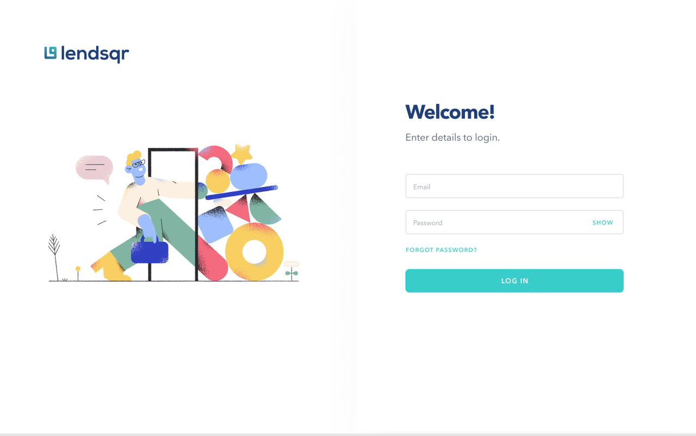

# lendsqr-fe-test

## User Dashboard with Mock API Integration
This project is a responsive frontend application that provides a user management interface with four key pages: Login, Dashboard, User Page, and User Details Page. The focus is on delivering an intuitive and accessible user experience while integrating with a mock API to simulate real-world data handling.

## Key Features
- **Login Page**: Provides a basic authentication UI to simulate user login.
- **Dashboard**: Acts as the central hub for quick navigation to other pages, displaying summary data for the application.
- **User Page**: Lists 500 users fetched from a mock API, including essential details for quick browsing.
- **User Details Page**: Displays detailed information for each individual user. User data is stored locally using Local Storage or IndexedDB to improve load speeds and enable offline access.

## Technical Details
- **Mock API Integration**: Data is fetched from a mock API containing 500 records to simulate real-world data scenarios.
- **Local Storage / IndexedDB**: Storing user details locally enhances performance and provides data persistence across sessions.
- **Responsive Design**: The application is optimized for various screen sizes, including mobile, tablet, and desktop, ensuring a consistent and accessible experience across devices.

## Table of Contents
1. [Project Structure](#project-structure)
2. [Getting Started](#getting-started)
3. [Technology Stack](#technology-stack)
4. [Screenshots](#screenshots)
5. [Contributing](#contributing)
6. [License](#license)

## Project Structure
Here's an overview of the project's folder structure:


## Getting Started

- **Prerequisites**:
  - **Node.js** (v14+ recommended)
  - **npm** or **yarn**

- **Installation**:
  - **Clone the repository**:
    ```bash
    git clone https://github.com/stefniey/lendsqr-fe-test.git
    cd lendsqr-fe-test
    ```

  - **Install dependencies**:
    ```bash
    npm install
    # or
    yarn install
    ```

  - **Start the development server**:
    ```bash
    npm start
    # or
    yarn start
    ```

  - **Access the application**: Open [http://localhost:3000](http://localhost:3000) in your browser to view the app.
 
## Admin Login Details 
 - adedeji@lendsqr.com
 - password:test123

## Technology Stack
- **Frontend**: React, TypeScript
- **Styling**: Sass for modular and maintainable styling
- **State Management**: Local Storage or IndexedDB for local data persistence
- **Mock API**: Used to simulate user data and testing


## Screenshots

- **Login Page**:
  
  

- **Dashboard**:
  
  

- **User Page**:
  
  

- **UserDetails Page**:
  
  


  ## Contributing
- **Fork the repository**.
- **Create a new branch** for your feature (`feature-name`).
- **Commit your changes**.
- **Push to your branch**.
- **Open a pull request**.

## License
This project is licensed under the MIT License.


